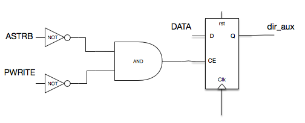
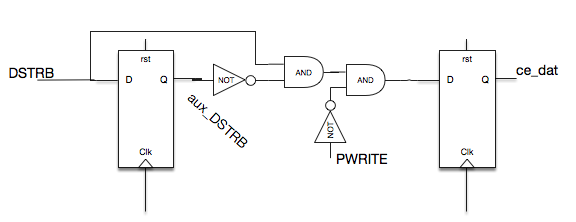
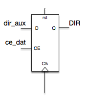
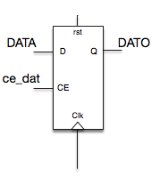
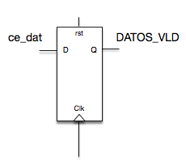

# Apartado 1. Diseño del controlador del puerto paralelo (EPP)
Para este apartado se nos proporciona en clase el diseño completo para modelar la entidad *epp_controler*.

Esta entidad es la encargada de actuar como interface entre el puerto USB del ordedaor y el diseño, es decir, recibe los datos enviados desde el PC con un protocolo EPP y proporciona dos salidas **DIR** (dirección) y **DATO** (dato), ambas de 8 bits y mostradas en codificación hexadecimal. Segun estas salidas y la siguiente tabla se realiza la función deseada.

| Dirección | Dato                | Función                          |
|:---------:|:-------------------:|:--------------------------------:|
| 11x       | 11x                 | Inicialización del códec LM4550 (RESTART) |
| F0x       | 00x-FFx             | Frecuencias de la nota           |
| B0x       | 00x-1Fx             | Volumen de la señal de audio     |
| CAx       | DDx                 | Tono por el canal derecho        |
| CAx       | 11x                 | Tono por el canal izquierdo      |
| CAx       | 22x                 | Tono por ambos canales           |
| CAx       | Resto combinaciones | Tono por ningún canal            |

## 1.1. Comprobación de la funcionalidad del controlador del puerto paralelo
Para la codificación del modelo en VHDL también se nos ha propocionado diversos archivos como es la declaracion de la entidad en el archivo *epp_controler.vhd*.

### Modelar la entidad *epp_controler*
Para modelar esta entidad hemos seguido los diseños propuestos por nuestro profesor.

1. Escritura de la dirección: este proceso comprueba que tanto la señal **PWRITE** (esta teniendo lugar un ciclo de escritura) como la señal **ASTRB** (esta teniendo lugar una tranferencia de direcciones) estan activas a nivel bajo recogiendo el valor de la direccion y guardandolo en la señal auxiliar **dir_aux**.

    

    ```vhdl
    direccion : process(RST, CLK)
    begin
      if RST='1' then
        dir_aux <= (others => '0');
      elsif CLK'event and CLK='1' then
        if (not ASTRB and not PWRITE) = '1' then -- CE = '1'
          dir_aux <= DATA;
        end if ;
      end if ;
    end process ; -- direccion
    ```


2. Detector de flanco de subida:

    

    ```vhdl
    datos : process(RST, CLK)
    begin
      if RST='1' then
        aux_DSTRB <= '0';
      elsif CLK'event and CLK='1' then
        aux_DSTRB <= DSTRB;
      end if ;

      if RST='1' then
        ce_dat <= '0';
      elsif CLK'event and CLK='1' then
        ce_dat <= DSTRB and not aux_DSTRB and not PWRITE;
      end if ;
    end process ; -- datos
    ```


3. Salida de la dirección: este proceso

    

    ```vhdl
    s_DIR : process(RST, CLK)
    begin
      if RST='1' then
        DIR <= (others => '0');
      elsif CLK'event and CLK='1' then
        if ce_dat = '1' then
          DIR <= dir_aux;
        end if ;
      end if ;
    end process ; -- s_DIR
    ```


4. Salida del dato: este proceso

    

    ```vhdl
    s_DATO : process(RST, CLK)
    begin
      if RST='1' then
        DATO <= (others => '0');
      elsif CLK'event and CLK='1' then
        if ce_dat = '1' then
          DATO <= DATA;
        end if ;
      end if ;
    end process ; -- s_DATO
    ```


5. Comprobación de valores correctos: sirve de sincronización para las salidas anteriores indicando que hay nuevos valores en ellas.

    

    ```vhdl
    s_DATOS_VLD : process(RST, CLK)
    begin
      if RST='1' then
        DATOS_VLD <= '0';
      elsif CLK'event and CLK='1' then
        DATOS_VLD <= ce_dat;
      end if ;
    end process ; -- s_DATOS_VLD
    ```

6. PWAIT

    

    ```vhdl
    PWAIT <= not ASTRB or not DSTRB;
    ```

### Simulación funcional de la entidad *epp_controler*

### Simulación temporal de la entidad *epp_controler*


## 1.2. Descarga en placa del controlador del puerto paralelo
